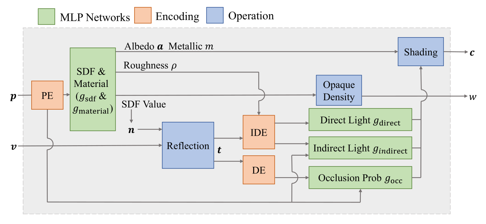

# 神经 BRDF (基于 NeRO)

## 背景

1. 多视角重建对于高光或者镜面，物体颜色会随观测方向变化，违反视差一致性

2. 神经隐式表示与体渲染 + 考虑物理光照

3. 微表面 BRDF 模型 (Cook-Torrance)：将表面反射分为漫反射和，镜面反射部分

   - 漫反射部分：朗伯系数
   - 镜面反射部分：基于微表面理论，通过法线分布函数（GGX分布），Fresnel 项（参数是出射/入射角，金属度，输出反射率）和几何遮挡项

4. Kajiya 渲染方程：描述点的出射辐射度对于入射半球辐射度与表面 BRDF 以及余弦因子的积分结果，采用分裂求和近似（Split-sum）求解，光照积分拆成环境光照与 BRDF（NeRO 第一部分方法）。第二部分使用蒙特卡洛采样，通过重要性采样分别对漫反射余弦权重半球和 GGX 镜面半球采样，准确估计颜色

5. 神经渲染技术：

   - NeRF（Neural Radiance Fields）对每个点学习体密度和辐射度
   - NeuS（Neural Implicit Surfaces） 曲面表示为神经SDF零水平集，无偏体渲染模型直接学习 SDF（距离符号函数）
   - Ref-NeRF 在 NeRF 基础上将出射光分为漫反射和镜面反射分量，并通过集成方向编码（IDE）对视角编码进行预积分

6. 球谐函数 SH（Spherical Harmonics）：

   球谐函数是一组定义在单位球面上的正交完备基，可将任意方向函数分解为有限或无限的基函数线性组合。用有限阶 L 的实球谐时，系数数量为 L²，阶数越高可表示的空间频率越高。其显著特性包括：

   - 正交性与能量分离：便于最小二乘投影与误差分析。
   - 旋转与卷积友好：方向函数的旋转可在系数域通过矩阵作用实现；与低频核（如夹紧余弦）的卷积在系数域能高效计算。
  
   因此 SH 常用于表示低频的环境辐照度、预计算辐射传输等。缺点是表示高频尖锐特征代价较高，需高阶展开并可能出现振铃效应。实现时需要统一角度参数化、归一化与坐标系约定，并保证采样充分与数值稳定。

7. 基于图像的光照 IBL（Image-Based Lighting）：

   IBL 使用 HDR 全景图或立方体贴图记录来自各方向的入射光照分布。典型实时管线将反射积分拆为可预计算部分与运行时查找：

   - 漫反射：环境贴图与夹紧余弦核卷积，得到低频辐照度贴图，用于朗伯项。
   - 镜面：对环境贴图按粗糙度进行重要性采样预滤，得到“预滤环境贴图”（mip 层对应不同粗糙度），再配合二维 BRDF 积分 LUT（包含 Fresnel/几何项的平均影响）进行 Split-sum 重建。
   - 近场处理：通过立方体反射探针与视差修正近似局部反射。

   优势是易与 PBR 管线结合、成本与质量平衡好；不足在于遮挡与强近场效应难以准确表达。实现上需在线性空间进行光照运算，正确处理曝光与色调映射，保证法线与反射向量在一致坐标系下计算。

8. 屏幕空间环境光遮蔽 SSAO（Screen-Space Ambient Occlusion）：环境光遮蔽衡量几何局部对环境光的遮挡程度。

   SSAO 在屏幕空间利用深度与（或）法线，近似估计每像素半球方向上的被遮挡比例。常见流程为：

   - 从深度重建视空间位置与法线；
   - 在切线空间半球内以随机旋转核采样，比较样本深度与方向几何关系累积遮蔽；
   - 最后用双边或跨域滤波降噪并保持边缘。变体如 HBAO、GTAO 在核设计、可见性模型与稳定性上有所改进。
  
   优点是完全后处理、实时性好；

   缺点是只依赖当前可见几何，对屏幕外与遮挡后的结构无感知，容易噪点与光晕，需要与 TAA/时域降噪配合。

9. 立方体贴图 Cube Map：

   立方体贴图用六个正方形面（±X、±Y、±Z）表示从一点出发的全向环境。采样时将方向向量映射到对应面与二维坐标。典型用途包括天空盒渲染、反射与折射查询、IBL 的辐照度与预滤反射贴图等。实现要点：

   - 准确的方向到面与 UV 映射，避免接缝（可用 seamless cubemap 采样）。
   - 正确的 mip 映射与预滤策略，以支持粗糙度可变的镜面。
   - HDR 存储格式（如浮点或 RGBE）与线性/伽马空间一致性。

   近场反射可通过盒体或球体近似实现视差修正，多探针混合用于大场景。

9. 球面高斯 Spherical Gaussian（SG）：

   球面高斯在球面方向定义一个具有中心方向、锐度与幅值的“叶瓣”分布，常写作 S(ω)=A·exp(λ(μ·ω−1))。多个 SG 可线性叠加逼近复杂方向函数。其关键优势是：

   - 乘积与积分的解析或高效近似：两个 SG 的乘积仍可近似为一个 SG；与夹紧余弦核的卷积、以及在单位球面上的积分都存在稳定的解析公式。
   - 旋转简单：仅需旋转中心方向 μ。

   因此 SG 适合表示高频镜面叶瓣、模糊高光与方向相关光照，常用于快速近似“光照×BRDF”的方向积分。拟合可通过最小二乘、EM 或逐步加叶瓣等方法完成。不过需要注意在高锐度下的数值稳定与颜色分量的独立或共享表达。

9. 3D 高斯泼溅 3DGS（3D Gaussian Splatting）：

   3DGS 用大量各向异性的 3D 高斯作为显式基元表示场景辐射场。每个高斯包含位置、协方差（或尺度与方向）、不透明度以及颜色或方向相关表示（如 SH 系数）。渲染时将高斯透视投影为屏幕空间椭圆并进行加权覆盖与前到后 Alpha 合成，避免沿射线的稠密体采样，因而能实现实时渲染。训练通常从已定姿态的多视图图像出发，通过可微渲染最小化重投影误差，并结合密度增殖与冗余裁剪维持表示质量。

   优势是显式可渲染、速度高、对复杂几何与材质友好；

   局限在于内存占用偏高、透明/体散射与全局光输运需额外建模，极端密集场景下的排序与合成也具工程挑战。

### 参考资料

   1. LearnOpenGL（SSAO）: <https://learnopengl.com/Advanced-Lighting/SSAO>
   2. 博客（SSAO 讲解）：<https://www.cnblogs.com/KillerAery/p/15335369.html>
   3. 论文：SGCR: Spherical Gaussians for Efficient 3D Curve Reconstruction
   4. 论文：3D Gaussian Splatting for Real-Time Radiance Field Rendering

## 网络架构

### 神经 SDF 网络

**p(x,y,z) 空间坐标**经位置编码 PE 输入，输出该点到物体表面的**有符号距离**（零水平集即物体表面），同时也可导出法向量辅助渲染

### 材质网络

以**表面点或法向量**为输入，预测**材质参数**，金属度 m，粗糙度 r，反照率 a，这些参数控制 Cook-Torrance BRDF 模型行为

### 光照网络

1. 包含两个主要MLP：直接和间接光网络，以及一个额外的遮挡网络，直接光网络接受**光照方向编码**，预测来自无穷远光源的直接辐射强度，间接光网络接受**空间位置和方向编码**，预测由物体表面反射产生的间接光照，遮挡网络对每一个采样射线预测一个 [0,1] 间的**概率**，判断该方向上光线是否被物体自身遮挡

2. 输入 v **视角方向**，加入**法向量**经过反射计算**出射光线方向** t。DE 是方向编码，将单位方向编码映射为更高维的特征向量，让 MLP 能够更有效表达。IDE 则是对方向分布做积分后展开（DE 仅对方向直接余弦展开），相比低频或者直接光，可表示高频镜面反射或者模糊高光。IDE 由Ref-NeRF 提出，对每一个采样方向的预集成编码来平滑和加速积分计算。

3. Opaque Density 是不透明度，输入 SDF，输出 w **体渲染权重**

4. Shading 积分计算物体表面对入射光的反射颜色，输出**颜色** c，这里用 Split-sum 和 IDE 近似计算

### 摄影师表面模型

解决现实拍摄中摄影师自身出现在反射中的问题，构建了一个 2D NeRF 模型，通过 MLP 计算反照率和颜色，判断是否击中摄影者，并将摄影者反射视为光照的一部分纳入计算

## 光照表示和方向编码

### 光照分解

分解为直接光和间接光，已经说明在光照网络中

### 方向编码

直接光网络采用球面调和基底函数 SH 将方向映射到高阶，间接光网络采用传统位置和方向编码。第一阶段，Split-sum 近似对 BRDF 积分采用 IDE 处理，捕获高频镜面反射。第二阶段，几何已经固定，采用蒙特卡洛采样，精确计算

### 球面交点编码 SIE

直接光仅靠方向无法准确定位强光源（尤其近处），在第二阶段，对直接光 MLP 额外输入了发射点沿方向射线与包围球相交的点坐标

## 训练损失

### 渲染损失

采用 Charbonier 损失度量体渲染合成的像素颜色与输入图像颜色的差异，主要训练损失

### Eikonal 损失

目的为规范神经 SDF 网络，强制梯度范数趋向 1 以保证场域近似为距离函数

### 遮挡一致性损失

对每个样本点以其反射方向进行射线跟踪得到真实遮挡概率，强制 MLP 预测结果与之匹配（第二阶段，不用网络，用物理计算

### 表面稳定性正则

### 阶段 II 正则项

1. 材质平滑正则，平滑粗糙度，金属度，反照率

2. 漫反射光白化正则，强制漫反射光色接近白光（最小化漫反射光 RGB 通道与平均值差异）

## 数据集构建

1. Glossy-Blender 合成光滑物体数据集

2. Glossy-Real 真实世界的光滑物体数据集

## 验证与评测指标

1. 几何评价指标：采用 Chamfer 距离衡量重建表面与真实表面点云匹配度

2. 重光照评价指标：估计的材质与Blender生成的图像对比

3. 消融实验

## 理解与问题

1. NeRO 是**多视角重建**不是单目估计，多张照片输入，以这些视角的相机位姿联合优化隐式 SDF，材质和光照。镜面高光会破坏光度一致性，所以 NeRO 分两阶段并使用 BRDF 和 光照建模

2. 优化在于对于**无目标掩码**，**未知环境照明**情景，采用显式物理渲染模型，环境光近似技术和两阶段优化策略

3. 体渲染采样，SDF 平滑化以及损失中的平滑正则，使得隐式 SDF 在细薄和高曲率结构（尤其反光强烈时）中出现模糊和拓扑错误，损失了物体**表面细节**，没有细节感觉多视角的一部分优势就没有了

4. 对**相机质量敏感**，尤其在反射强时，高光导致欺骗匹配（曝光问题）

5. **近场光源**问题，SIE 处理不足

6. **材质/光照分离模糊**，RGB 图像对反照率和照明强度有尺度模糊，还有如何辨别漫反射和间接光，尤其是反射表面（如何分离金属度，粗糙度，光照）

7. **透明、半透明、发光、参与媒质（雾和烟）场景**，体散射场景不适用不透明微表面 BRDF（类似于烟、雾、尘埃、玉石、牛奶等对所穿过的光线产生散射、吸收等作用的空间介质被称为 参与介质（participating media）。因为 BSDF（Bidirectional Scattered Distribution Function，即双向散射分布函数）只考虑了光线在物体表面散射，所以无法准确地建模参与介质。）

## 日志

### Before 10.11

- 分析论文
- ...

### 2025.10.11 - 10.14

- 相机质量相关问题是否可以用图像处理技术，例如人工调整颜色，处理曝光和对比度等，尤其对于高感和高位深相机
- 材质不同的问题是否可以用语义分割，分开不同场景的表面，例如透明、半透明，对于参与介质和发光，再做其他考虑
- 添加背景：球谐函数 SH，基于图像的光照 IBL，屏幕空间环境光遮蔽 SSAO，立方体贴图 Cube Map，球面高斯 Spherical Gaussian，3D 高斯泼溅 3DGS
- [IDE 的解释与推导](./IDE.md)

### 2025.10.15 - 10.22

- 进一步完善 [IDE 的解释与推导](./IDE.md)
- 分析 shading 中如何从输入的参数中取得空间位置信息，即 [MLP 的详细分析与其他关联内容的描述](./MLP.md)

### 2025.10.23 - 10.28

- 解决环境冲突，修改代码以能正常完成环境配置，得到 [conda 环境配置文件](./environment.yml)
- 训练 44999 轮

### 2025.10.29

- 了解数据预处理过程
- 分析主体与背景区分和训练过程细节
