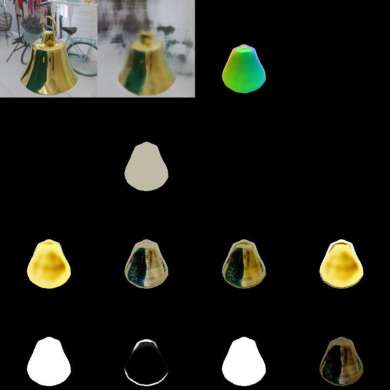
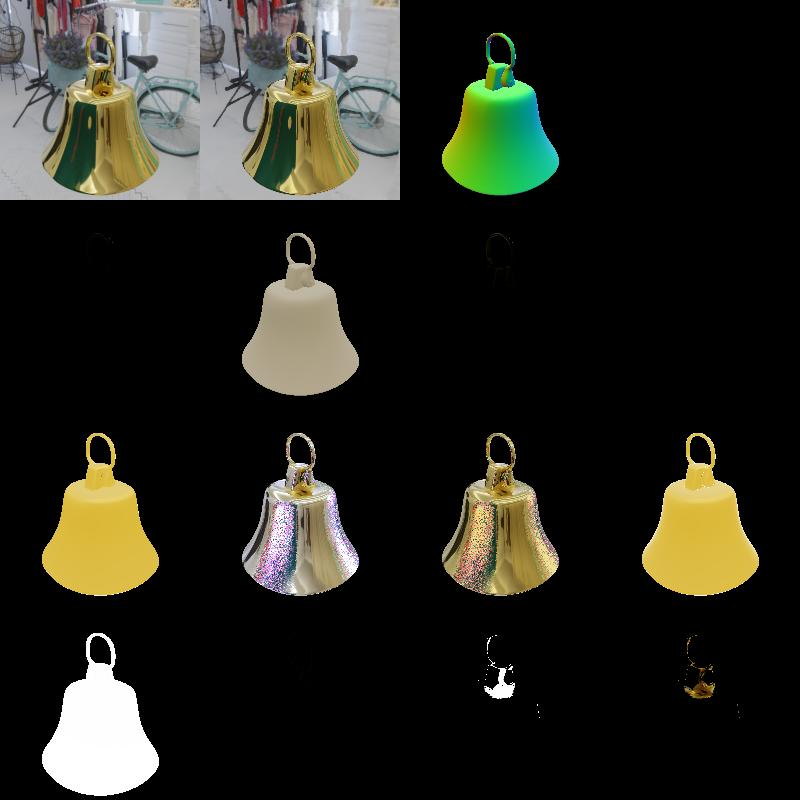
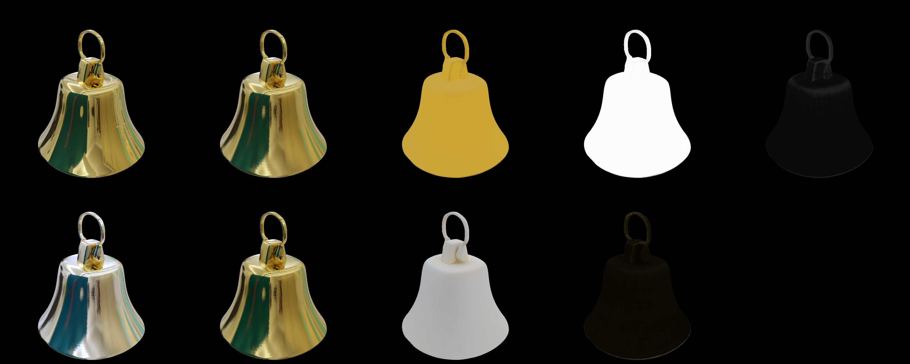

# 训练与“主体 / 背景”区分技术说明

**说明与范围**：

- 训练前的数据预处理与组织（包含 unit‑sphere 归一化、COLMAP 输出处理、可选 mask）；
- 训练时如何把“主体（target object）”与“背景/其他物体”区分（理论机制、损失项、实现路径）；
- 两阶段训练（Stage I: Shape / Stage II: Material）精细步骤、采样策略、超参与调试要点；
- 关键代码定位（文件与函数/脚本名）与运行命令示例。

> **引用**：基于官方仓库文件列表与 README（liuyuan‑pal/NeRO）。参照仓库的 `run_training.py`、`network/`、`raytracing/`、`train/`、`extract_mesh.py` 等模块。

## 目录

1. 项目背景与总体流程
2. 数据采集与预处理
3. 单位球归一化（unit‑sphere）与前景/背景分治设计原理  
4. 渲染与采样流水（内/外分支、SDF→density 映射、IDE 与方向编码）  
5. 损失项（photometric, eikonal, occ, initSDF, regularizers）与代码对应项  
6. 两阶段训练（Stage I / Stage II）步骤与超参
7. 训练期间主体与背景如何被区分（机制分解、时间演化、可视化检查）  
8. 关键源码定位（文件→函数→何时被调用）与运行示例命令（来自 repo README）  
9. 调试与性能  
10. 附录：训练清单

## 1. 项目背景与总体流程

NeRO（Neural Geometry and BRDF Reconstruction of Reflective Objects）是一套**场景/物体级的端到端可微渲染重建系统**，目标是仅用多视角 RGB 图像（带相机位姿）重建具有高光/镜面反射特性的物体几何（隐式 SDF）和材质（BRDF），并支持后续重光照（relighting）。实现由论文与开源仓库协同提供：训练脚本 `run_training.py`、分阶段配置 `configs/shape/*` 与 `configs/material/*`、以及导出/评估脚本 `extract_mesh.py`, `extract_materials.py` 等。

总体训练流程：

1. 数据准备（images + poses; 可选 masks / point cloud）  
2. Stage I（Shape）：训练 SDF 网络 + 基本 appearance 模块，用近似（IDE + split‑sum）稳定几何与遮挡估计；导出 mesh。  
3. Stage II（Material）：在固定几何上精化材质/BRDF（或用表面采样训练 shading 网络），并可导出为纹理/贴图供离线渲染。  
4. （可选）Relight / Extract：把几何与材质导出到 Blender 等渲染器进行目标环境下的重光照。

## 2. 数据采集与预处理

### 2.1 必需输入

- 多视角 RGB 图像（30+ 张）；图像应 **线性化**（从 sRGB 反伽马或使用 RAW）。  
- 相机内参 + 外参（poses），通常使用 COLMAP 恢复（`images.txt`, `cameras.txt` 或 JSON 格式）。
- 额外项：object mask（若能提供，加速收敛）、参考 HDR 环境图（用于 Stage II 验证）、粗略点云（用于归一化）。

> 代码：仓库 README 说明了数据组织结构以及如何运行训练脚本（示例：`python run_training.py --cfg configs/shape/real/bear.yaml`）。

### 2.2 图像预处理

1. **线性化（Linearize）**：若输入是 sRGB，需做反伽马或用相机提供的曝光/响应曲线将其转为线性 radiance。训练对线性输入敏感，Stage II 的材质学习尤其依赖线性光度。  
2. **尺寸与 K 更新**：如做 resize / crop，同步更新内参矩阵（fx,fy,cx,cy）。  
3. **（可选）色彩 / 曝光统一**：如拍摄时曝光漂移，需要统一曝光或把曝光作为额外输入/学习变量。

### 2.3 相机标定与剔除坏视角

- 使用 COLMAP（或其他 SfM）生成相机 poses。`run_colmap.py` 在仓库中提供了自动化调用示例。剔除 COLMAP 中 reproj error 大或稀疏匹配差的视角以免扰动训练。

### 2.4 坐标归一化（unit‑sphere）与数据组织

- 建议把目标物体在三维空间缩放/平移使其包含在单位球（radius ≈ 0.9 或 1.0）内。具体做法：用 COLMAP 点云估计中心 `c` 和最大半径 `r_max`，然后对所有相机中心、点进行统一仿射变换。该归一化是 NeRO 内部处理（dataset loader 有对应逻辑），并且对内/外分支（主体/背景）策略至关重要。

### 2.5 masks（可选）

- 合成数据：直接用渲染器输出 alpha / object id（Blender 等）。  
- 真实数据：可用 U²‑Net、SAM 或 COLMAP reproject→threshold 等方法生成半自动 masks（`custom_object.md` 给出自定义对象流程说明）。mask 可用于训练时的“前景偏置采样”，但 NeRO 在设计上**不依赖** mask（Glossy‑Real 没有提供 mask），其学习机制通过几何一致性自动压制背景；mask 仅作为加速或鲁棒性提升手段。

### 2.6 保存与目录结构

- 按仓库 README 推荐的目录组织数据（见 `data/GlossyReal/<scene>/`）。examples & configs 在 `configs/shape/*` 与 `configs/material/*` 中。

## 3. 单位球归一化与前景/背景分治设计原理

### 3.1 设计要点

NeRO 将场景空间划分为 **内部（unit sphere 内）与外部（unit sphere 外）**：

- **内部（主体）**：用隐式 SDF 网络建模；SDF→density→alpha 并结合基于法线的 shading 网络预测颜色。  
- **外部（背景）**：采用一个远场背景网络（NeRF++ 风格）或类似后处理来建模环境/远处几何与光照。

这种分支结构使得网络能把**几何可定义、具有清晰表面结构的主体**集中为内部 SDF 表面，而把复杂遥远背景放到外部 NeRF++ 分支解释，从而天然解耦。代码中关于“内/外”分支的实现逻辑存在于 `network/` 与 `raytracing/` 渲染模块中（render pipeline 在 `network/renderer.py` 等文件实现）。

### 3.2 理论基础（即为什么能区分背景）

- **多视角一致性约束**：主体表面在不同视角投影一致，能被单一三维表面解释并同时最小化所有视角的 photometric loss；背景往往因视差在不同视角不能被单一内表面解释，因而优化过程中被压制为低密度。（之后可能会进一步分析原理，暂时这样理解）
- **SDF→density 映射 + 体渲染权重**：SDF 在表面处的零交点产生高密度（或高 alpha），使得颜色贡献主要集中在真正的表面位置；背景点因 SDF 值远离零点而具有低密度，几乎不贡献颜色。  
- **OccNet / 遮挡与光照网络**：进一步约束不可视方向的光照、阻止网络通过将光照刻画到错误表面来拟合观察值。
上述理论在论文与实现中都有说明（并在 `train/` 与 `network/loss.py`中体现为具体损失项）。

## 4. 渲染与采样流水（实现细节）

### 4.1 光线采样与分段

- 从像素出发沿射线采样深度（粗/细分两阶段采样），对每段计算 `p = o + t d`，再判断 `||p|| ≤ 1`（内）或 `>1`（外），分别送入内部或外部网络。该流水在 `raytracing/` 与 `network/renderer.py` 中得到实现。

### 4.2 内部（主体）网络：SDF → alpha / sigma

- SDF network 输出 $s(p)$。通过 autograd 计算法线 $\mathbf{n} = \nabla s(p)$。  
- 将 $s(p)$ 用一个可学的尺度（`inv_s`，SingleVarianceNetwork）映射成段密度/alpha（遵循 NeuS 的设计）。数学表达式形式上常用：
  $$
  \sigma(p) = \text{sigmoid}(-s(p) \cdot \text{inv\_s}) \cdot \text{scale},
  \quad \alpha = 1 - \exp(-\sigma \delta)
  $$
  实现细节和常数在 SDF→density 实现里（`network/` 下 SDF 相关模块）。Autograd 在代码中用于直接求 $\nabla s$ 以恢复法线。

### 4.3 外部（背景）网络：NeRF++ / far field

- 远场点由独立的 background network 估计颜色与 alpha，负责解释环境/背景像素（NeRF++ 的实现细节在 `network` 与 `raytracing` 模块中）。该分支减轻了主体网络需要解释远场复杂结构的负担。

### 4.4 方向编码（IDE）与 directional MLP（specular）

- IDE（Integrated Directional Encoding）与 split‑sum 近似用于在 Stage I 快速估计视角相关镜面项；方向编码（按粗糙度处理的球谐/带通特征）由方向 MLP 联合 bottleneck 特征预测镜面 RGB。NeRO 的 `network` 包含 direction / shading 的实现模块（configs 中的 `L` / SH 带宽设置）。

### 4.5 体渲染聚合

- 内外两分支的颜色/alpha 按 NeRF 的 alpha compositing 规则聚合（从近到远累乘透射），得到最终像素预测 $C_{\text{pred}}$。实现即 `network/renderer.py`（render core）。

## 5. 损失项

> 下面列出的损失项均在 NeRO 的实现中可见。在 `network/loss.py` 或 `train` 脚本中有损失权重、启用策略与 schedule。

### 5.1 Photometric loss（L_rgb）

- 最基本的图像像素重建误差（L2 或 L1），对全部采样像素计算（若提供 mask 可按 mask 加权）。实现路径：训练循环（`run_training.py`）调用 renderer 得到 `C_pred` 并与 `C_gt` 比较。

### 5.2 Eikonal loss（L_eikonal）

- 用以约束 SDF 的梯度范数接近 1：$\|\nabla s(p)\| \approx 1$。通常在网络中对一组均匀采样的体点计算并把平方误差加入损失。可在 `network/loss.py` 或 SDF module 中找到相应实现（提供 Eikonal 作为常见正则）。

### 5.3 Occ / Visibility loss（遮挡一致性）

- NeRO 设计了一个遮挡一致性项来防止镜面把远处环境纹理错误地表现在主体表面上。它通过在表面附近沿方向细采样并构造“交点概率/visibility”作为 pseudo‑ground‑truth，训练 OccNet 输出与之匹配。该损失与渲染管线深度采样紧密耦合，位于 `network` 与 `train` 的 occ 相关实现中。

### 5.4 Init SDF / Surface priors

- 一些初始化正则（例如对 SDF 在远离表面区域的值范围约束）用于避免早期 SDF 出现奇异形态，这些在实现中以小权重附加在 early training steps 上，config 可设置（`configs/shape/*`）。

### 5.5 Material / BRDF regularizers（Stage II）

- Stage II 在表面上学习材质，会加入 smoothness、value range 等先验以避免 BRDF 参数出现不稳定。相应正则在 `configs/material/*` 中有权重和参数说明，并在 `extract_materials.py` 等脚本中使用。

## 6. 两阶段训练（Stage I / Stage II）步骤与超参

### Stage I — Shape（目标：稳定 SDF 与遮挡估计）

**运行命令（示例）**：

```bash
python run_training.py --cfg configs/shape/real/bear.yaml
```

（README 中以相同形式示例了 syn/real 的配置）

**关键步骤**：

1. 数据载入（train loader 读取 images + poses）——`train/` 与 `dataset/` 实现。  
2. 光线采样（前景偏置 sampling 若提供 mask，可提高前景 rays 比例）。  
3. SDF network 前向计算；用 autograd 求法线。  
4. SDF → sigma/alpha 转换（SingleVarianceNetwork 控制粗/细度）。  
5. IDE + direction MLP 估计初步观测的方向依赖项（split‑sum 近似用于加速）。  
6. OccNet 训练/推理（可选延迟启用），Eikonal 与 initSDF 正则并入损失。  
7. 记录训练中间结果（模型 checkpoint、data/train_vis、mesh 提取脚本可在中期使用）。

**超参**：

- batch rays: 1024–4096（根据显存）
- learning rate: 2e-4（Adam）
- foreground sampling ratio: 0.6–0.9（若 mask 可用）
- Eikonal weight: 0.1–1.0
- OccLoss 启用步：2000–20000（根据几何稳定性）

**输出**：checkpoint（用于 Stage II），可调用 `python extract_mesh.py --cfg configs/shape/real/bear.yaml` 导出 mesh。

### Stage II — Material（目标：基于稳定几何精化材质）

**运行命令（示例）**：

```bash
python run_training.py --cfg configs/material/real/bear.yaml
```

**关键步骤**：

1. 固定或微调 SDF（视配置决定），基于表面采样（mesh 或隐式交点）构造训练点。  
2. 在表面上训练 shading/material 网络，输入 `p, n, view_dir, bottleneck`，输出 albedo / roughness / metallic（或直接 color）。  
3. 使用更精确的 MC / importance sampling 对光照积分进行精化校正（Stage II 的重要差异）。  
4. 导出材质（`python extract_materials.py ...` 或 `extract_materials_texture_map.py` 生成 UV 纹理），并可在 Blender 中验证 relighting。

**输出**：材质文件夹（albedo.npy, roughness.npy, metallic.npy 等），以及可用于 relight 的 meshes 与 hdr。

## 7. 训练期间主体与背景如何被区分（机制分解、时间演化、可视化检查）

下面把“自动区分”拆成若干子机制，并说明如何在训练中监测与验证每一步的工作。

|  |  |  |
|:--:|:--:|:--:|
| Stage I 训练 4999 轮 | Stage I 训练 19999 轮 | Stage I 训练 299999 轮 |

|  |  |  |
|:--:|:--:|:--:|
| Stage II 训练 4999 轮 | Stage II 训练 14999 轮 | Stage II 训练 99999 轮 |

### 7.1 机制一：多视角 photometric 一致性（核心）

- 解释：只有几何一致的表面能在所有视角同时降低 photometric loss。背景通常无法用单一 3D 表面解释，因此优化倾向于把颜色解释为背景分支或低密度体。  
- 验证：查看训练中 held‑out view 的 PSNR/LPIPS 是否随训练上升；若训练早期背景也能拟合但随训练消失，说明多视角约束生效。

### 7.2 机制二：SDF→alpha 的峰化（权重集中）

- 解释：SDF 的零等值面处 alpha / weight 峰化，导致颜色贡献局限在真实表面。背景 SDF 值通常较远导致 alpha 低。  
- 验证：沿射线看 alpha 分布图（render_vis 中常见），应看到权重集中在表面深度。`data/train_vis` 目录保存可视化。

### 7.3 机制三：OccNet 与 visibility 约束抑制镜面“贴图”

- 解释：OccLoss 通过显式考虑可见性使得镜面反射不能无约束地把远处环境纹理“刻”到表面上。
- 验证：关闭 OccLoss 与启用 OccLoss 的对比实验（PSNR、可视化差异）；相关 ablation 配置。

### 7.4 机制四：外场（NeRF++）解释远场与背景

- 解释：远处背景由专门分支解释，避免主体网络过拟合远场结构。  
- 验证：检查外部分支输出（可在渲染模块中提取）并观察其是否重建背景纹理。

### 7.5 时间演化（training timeline）

- 初期：网络尝试用宽平的密度解释颜色，alpha 分布较平滑。  
- 中期：photometric 约束推动 SDF 在表面位置收敛，alpha 峰化，OccNet 逐步学会可见性。  
- 后期：Stage I 收敛后 Stage II 精化 BRDF，材质参数收敛到物理可解释区间。  
- 在 `data/train_vis` 与 checkpoint 可查看每阶段的中间结果。

## 8. 源码

- `run_training.py` — 主训练入口（解析 cfg，启动 Stage I 或 Stage II）。
- `configs/shape/*`、`configs/material/*` — 不同场景与阶段的训练配置（超参数、dataset 路径、损失权重）。
- `network/` — 核心网络实现目录（SDF network, shading network, IDE/SH 相关）；含 `renderer.py`, `sdf_net.py` 等文件。
- `raytracing/` — 光线采样、射线/深度采样、以及用于 Stage II 的几何交点求解等工具。
- `train/` — 训练 loop 与数据 loader（batch 采样、前景偏置实现）。  
- `extract_mesh.py` — 从训练 checkpoint 导出 mesh（Marching Cubes / 等值面抽取）。
- `extract_materials.py`, `extract_materials_texture_map.py` — Stage II 后处理/导出材质为数组或纹理。
- `relight.py` — 将导出的 mesh & materials 在 Blender 中进行 relight。

---

## 9. 调试与性能

### 9.1 报错 / 不收敛常见原因

- 相机 poses 不准确 → 修复 COLMAP 输出 / 剔除异常视角。  
- 图像未线性化或曝光不一致 → 统一处理。  
- 数据未正确归一化到 unit sphere → 导致背景/主体混淆。

### 9.2 调试

1. 检查 `data/train_vis` 中中间渲染（是否出现大量“虚假”高亮或背景被拟合）。  
2. 导出中期 mesh（`extract_mesh.py`）观察几何是否有漂移/穿孔。  
3. 逐步启用损失（先只用 L_rgb + eikonal，再加 occ loss / init prior）观察影响。  
4. 尝试提高前景采样比例或提供 rough object mask 进行比较。

### 9.3 性能

- 理论上 Stage I 为几何优化，通常比 Stage II 更快；Stage II 用更精确的采样 / MC，开销更大。但是实际发现 Stage II 更快。

## 10. 附录：训练清单

> 已经得到了 [conda 环境配置文件](./environment.yml)

1. Clone repo & install deps:

    ```bash
    git clone https://github.com/liuyuan-pal/NeRO.git
    cd NeRO
    pip install -r requirements.txt
    # nvdiffrast & raytracing per README
    ```

2. Prepare dataset in `data/GlossyReal/<scene>` or use provided sample data.

3. Stage I train:

    ```bash
    python run_training.py --cfg configs/shape/real/<scene>.yaml
    ```

4. Extract mesh:

    ```bash
    python extract_mesh.py --cfg configs/shape/real/<scene>.yaml
    ```

5. Stage II train (material):

    ```bash
    python run_training.py --cfg configs/material/real/<scene>.yaml
    ```

6. Extract materials:

    ```bash
    python extract_materials.py --cfg configs/material/real/<scene>.yaml
    ```

7. Relight in Blender (optional):

    ```bash
    python relight.py --blender /path/to/blender --name <name> --mesh data/meshes/<mesh>.ply
    ```
